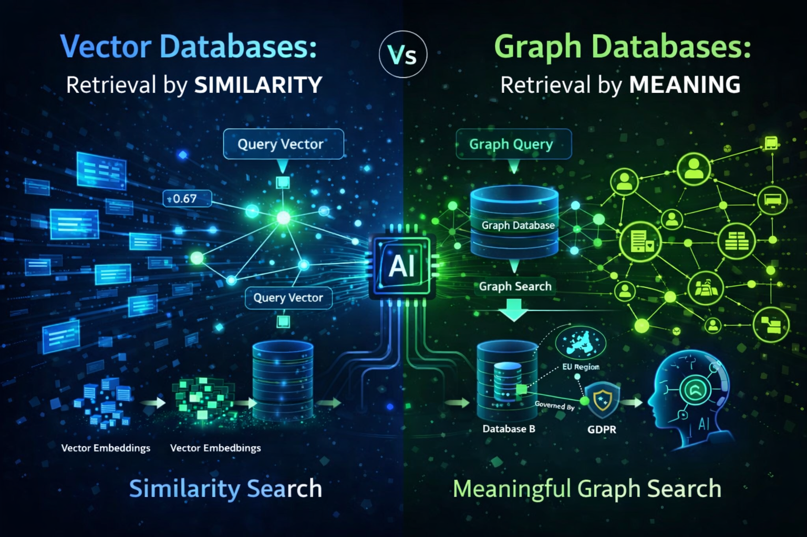

# Similarity-vs-Meaning-Vector-Databases-and-Graph-Databases-in-Modern-RAG

This project implements a Hybrid Retrieval-Augmented Generation (RAG) system that combines:

Vector-based semantic retrieval (FAISS + Sentence Transformers)

Graph-based reasoning (Neo4j knowledge graph)

LLM-based grounded answering (Groq LLaMA 3.1)

The goal is to show how semantic similarity + structured relationships together improve factual question answering and reduce hallucinations.

# 🔍 Why Hybrid RAG?

Vector RAG is good at finding similar text but weak at multi-hop reasoning.

Graph RAG captures relationships but lacks semantic recall.

Hybrid RAG combines both to answer complex, causal questions safely.

# 🧠 System Architecture

User Query
   ↓
Vector Search (FAISS + SBERT)
   ↓
Relevant Documents
   ↓
Entity Extraction (spaCy)
   ↓
Graph Expansion (Neo4j)
   ↓
Merged Context
   ↓
LLM Answer Generation (Groq – LLaMA 3.1)

# 📁 Dataset

A small biomedical-style corpus containing facts such as:

Disease → Cause

Disease → Treatment

Gene → Disease

Pathogen → Disease

# ⚙️ Tech Stack
Embeddings: Sentence-Transformers (all-MiniLM-L6-v2)
Vector DB: FAISS
NER: spaCy (en_core_web_sm)
Graph DB: Neo4j (Community Edition)
LLM: Groq API (llama-3.1-8b-instant)
Language: Python

# 🚀 How It Works
1. Vector Retrieval
Embed documents and query using Sentence-BERT
Retrieve top-K similar documents with FAISS

2. Graph Reasoning
Extract entities from retrieved documents
Expand related entities using Neo4j queries

3. Hybrid Context
Combine vector-retrieved text + graph-expanded entities

4. Grounded Answering
Pass context to LLaMA 3.1 via Groq API
Enforce “answer only from context” to avoid hallucination

# 🧪 Example Query

Question: What drug is used to treat diabetes?

Answer:
=== Vector Retrieved Docs ===
- Diabetes is caused by insulin resistance. Metformin is used to treat diabetes.
- Alzheimer’s disease is associated with amyloid-beta plaque accumulation. Donepezil is used to manage Alzheimer’s symptoms.

=== Graph Entities ===
['Metformin', 'Donepezil']

=== Final Answer ===
Metformin.

